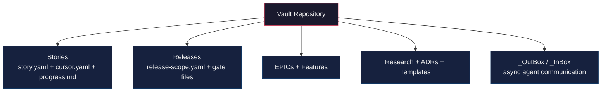
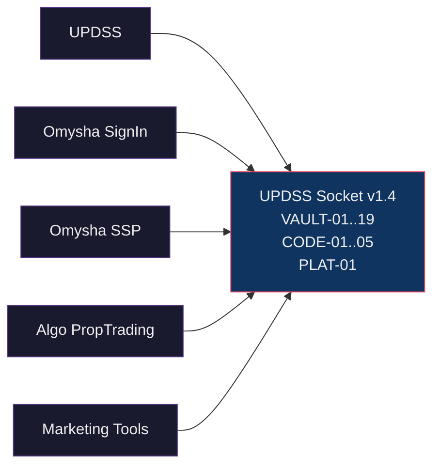
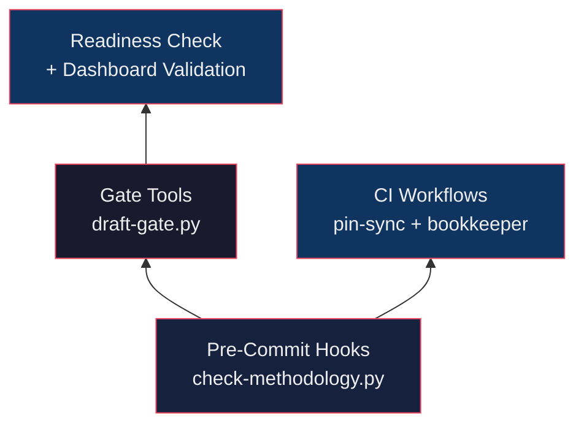

UPDSS is built on one principle: **governance state and code must live in separate places.** Everything else follows from that.

Three layers make the system work. Each one solves a specific problem.

## Layer 1: The Vault

The vault is a Git repository that holds governance state. Only YAML and Markdown. Never code.

Stories live here (with their scope, budget, and progress tracking). Releases live here (with their gate files and cost data). EPICs, features, research documents, architecture decisions, templates: all in the vault. And critically, the `_OutBox/` and `_InBox/` directories that agents use to communicate asynchronously with the orchestrator.

Why separate the vault from code? Because if an agent can modify governance artifacts in the same repository where it writes code, you don't have governance. You have suggestions. The filesystem itself becomes the enforcement boundary. An agent implementing a feature literally can't approve its own gate because the gate file is in a different repository.

Every change in the vault has a Git commit hash, an author, and a timestamp. Full audit trail. No database dependency. Human-readable, machine-parseable.

## Layer 2: Socket-and-Plug

This is how UPDSS governs multiple products through a single platform. The metaphor is electrical.

The **socket** is UPDSS's interface: a conformance checklist that defines what any product must provide to connect. Currently at Socket v1.4, it specifies 19 vault-side items (VAULT-01 through VAULT-19), 5 code-side items (CODE-01 through CODE-05), and 1 platform-registry item (PLAT-01). Each checklist item has an ID, a description, a verify command, and an example.

The **plug** is the product's integration: a `plug:` section in the product's vault `product.yaml` declaring its identity, target socket version, and separation mode.

Want to connect a new product? Create a vault repo with the required directory structure, add a `product.yaml` with the plug declaration, point your code repo's `core.hooksPath` to UPDSS's hooks, and run the conformance checklist. Each onboarding took about an hour when I connected four products to Socket v1.4.

Socket versions evolve. v1.0 started with basic structure. v1.4 introduced mandatory vault-code separation, the `_InBox/_OutBox` pattern for async agent communication, and a required UPDSS tools declaration so enforcement hooks can locate `check-methodology.py` at commit time.

## Layer 3: The Enforcement Engine

This is where the thesis lives. Mechanical enforcement works. Procedural enforcement fails. Every procedural rule we wrote ("remember to update the cursor after implementation") was forgotten by agents within one or two releases. Every mechanical check we added held.

The enforcement stack, layer by layer:

**Pre-commit hooks** run on every `git commit` in any product repo. They validate commit message format (`[STORY-NNN-YY-ZZ][T-N]`), check branch policy, verify methodology doc versions, detect story ID collisions, and run triad consistency checks ensuring `release-scope.yaml`, `cursor.yaml`, and `G1.yaml` agree on the story set. One set of hooks governs all six products through cross-repo hook paths.

**Gate tools** auto-generate G1/G2/G3 gate files with checklists and test evidence. The `decision` field defaults to null (`decision: ~`). Agents physically can't approve a gate. Only the dashboard's approve endpoint can write `decision: approved`, and only after a human clicks the button.

**Readiness checks** run when an agent starts a session. Machine state (Python, Git, Docker), product state (hooks installed, vault pointer valid), and session state (active release, story assignment) all get verified before any work begins.

**CI workflows** catch what hooks can't. `methodology-pin-sync.yml` validates version-pin consistency on pull requests. `bookkeeper-status-bump.yml` auto-bumps story statuses when PRs merge. These replaced two procedural rules that agents forgot on every release.

**Dashboard validation** enforces that all gate checklist items are present before approval. G3 requires `status: released` with deployment confirmation.

## The Result

Five independent agents audited this enforcement stack (research R-093). Their finding: every item on the "what works" list is mechanical or structural. Every item on the "what fails" list is procedural. When your enforcement targets are ephemeral agents with no persistent memory, you can't train them. You can only constrain them.

Kali mitti, as we say. Black soil that holds its shape. Build the walls from that, not from promises.

*For the full technical walkthrough, read [Governance-as-Code: How UPDSS Governs AI Agents Building Production Software](/posts/governance-as-code/).*
