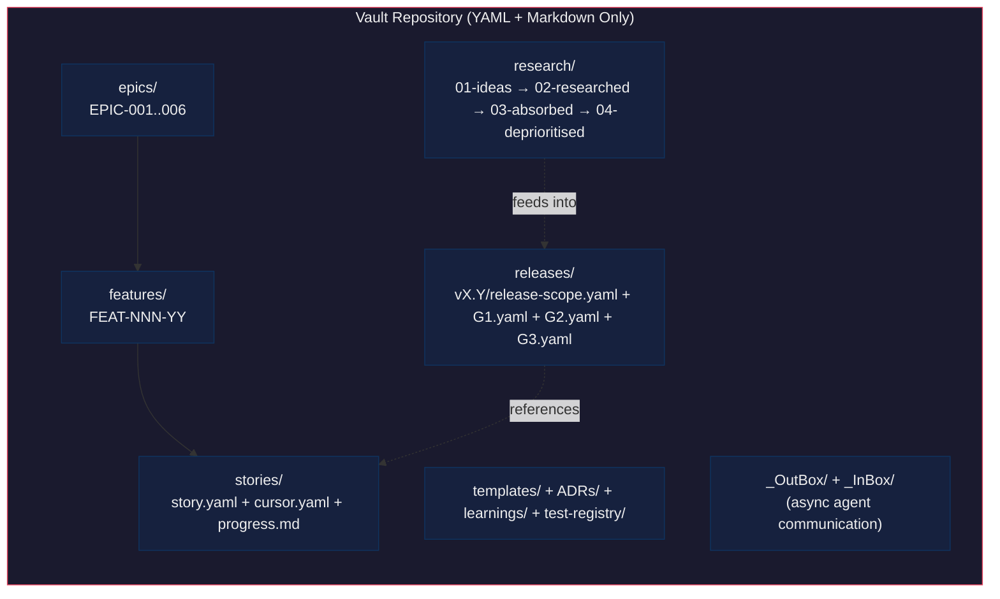
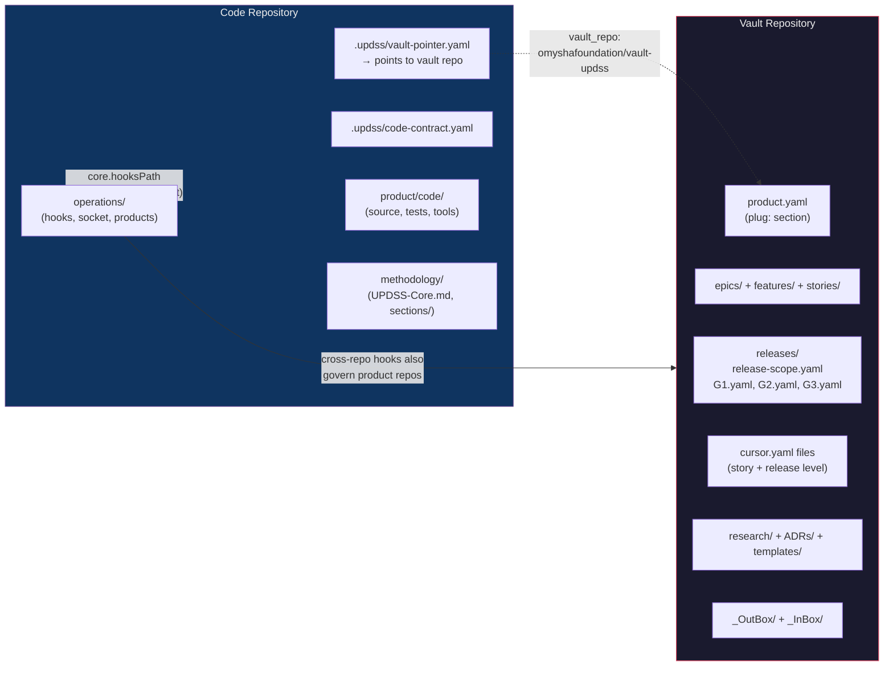
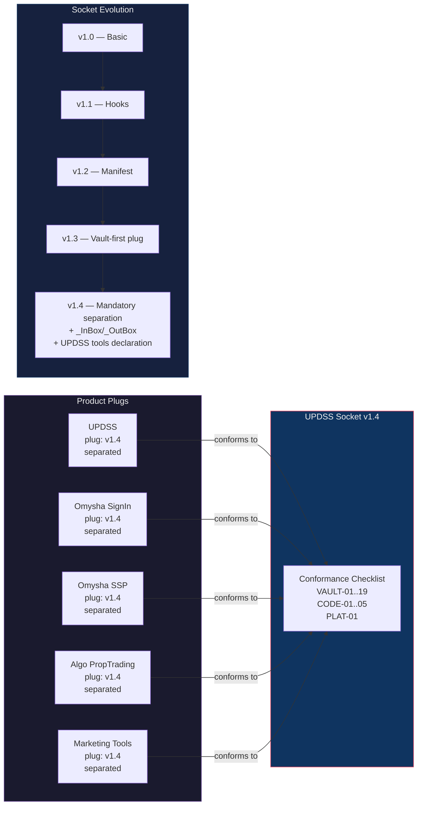
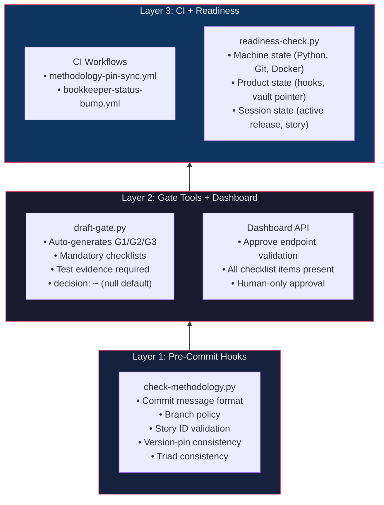
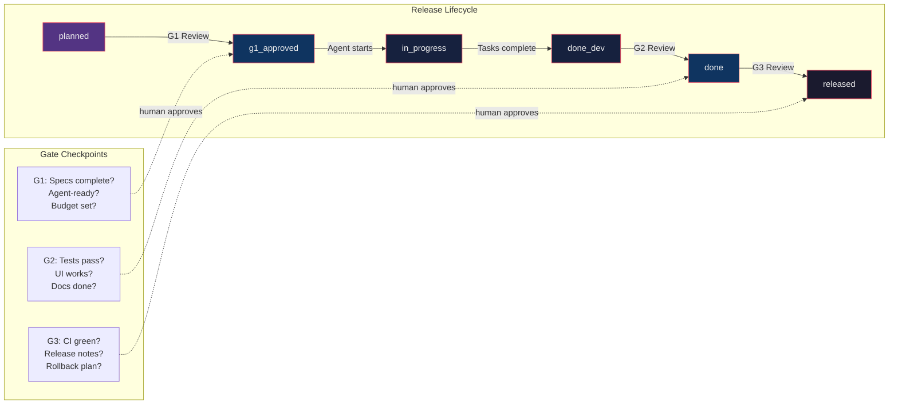
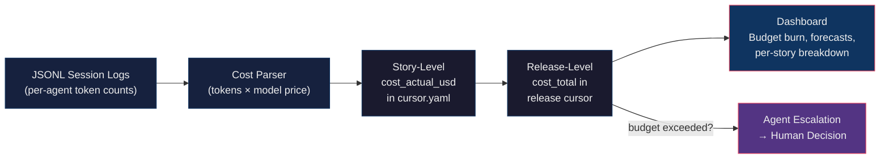
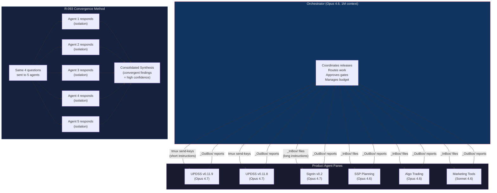

AI agents can write production code. That's no longer the interesting question. The interesting question is: can you trust what they ship?

UPDSS (Universal Product Development Support System) is a governance-as-code platform for AI-agent-driven software development. Not a project management tool. Not a CI/CD pipeline. Not an AI coding assistant. It's the control plane that ensures AI agents write code with traceability, quality gates, and human oversight at every stage. I've spent the last eight days running it across six products, directing nine AI agents through a tmux terminal, shipping 50+ releases for roughly $500 in API costs. This article describes what we built, how it works, and what we've learned.

## The Recursive Property

Here's what makes UPDSS unusual: it governs its own development.

The dashboard, the enforcement scripts, the gate tools, the pre-commit hooks -- all of it was built by AI agents operating under UPDSS governance. Every feature goes through G1/G2/G3 gates. Every commit carries a story ID. Every release has a scope, a budget, and a retrospective.

This self-hosting property creates a feedback loop that no external testing can replicate. When there's a bug in the governance layer, the agents building the governance hit it first. They report it. They fix it. In one eight-day stretch, I watched the same bug class -- cross-repo context contamination -- appear three times at three different layers (dashboard, git hooks, readiness check). Each time, a product agent discovered it, wrote a report to their `_OutBox/` directory, and the fix shipped in the next release. Each fix took under 30 minutes.

The system debugs itself. Not metaphorically. Literally.

## Architecture: Three Layers, One Principle

UPDSS is built on a single principle: **separation of concerns between governance state and code**. This separation manifests as three distinct layers.

### Layer 1: The Vault (Governance State)

The vault is a Git repository containing only YAML and Markdown. Never code. It holds stories (`story.yaml` + `cursor.yaml` + `progress.md`), releases (`release-scope.yaml` + gate files), EPICs, features, research documents flowing through a four-stage lifecycle, templates, Architecture Decision Records, and learnings.



Key design decisions:

**YAML, not database.** Everything is flat files in Git. Full audit trail. Branch and merge semantics. No database dependency. The tradeoff is performance -- reading 55 release directories is slower than a SQL query -- but the auditability is worth it. Every change has a commit hash, an author, a timestamp.

**Human-readable, machine-parseable.** Every YAML file can be opened in a text editor and also parsed by enforcement scripts. No proprietary formats anywhere in the stack.

**Vault is separated from code.** Each product has two repositories: a vault repo for governance and a code repo for implementation. This prevents agents from modifying governance artifacts while writing code. They're literally in different repositories. An agent implementing a feature can't quietly approve its own gate. The filesystem enforces it.



This two-repo split has four concrete benefits. Gate approvals committed to the vault land on `main` immediately, so every agent and every environment sees them without waiting for a release branch merge. Story and scope changes are instantly available to all agents, not gated behind a PR. Release branches in the code repo stay clean: only implementation diffs, no bookkeeping noise. And vault changes on `main` never create merge conflicts with vault changes on release branches, because vault changes don't go on release branches.

### Layer 2: Socket-and-Plug (Multi-Product Interface)

This is UPDSS's abstraction for governing multiple products through a single platform. The metaphor is electrical.

The **socket** is UPDSS's interface: a conformance checklist defining what any product must provide. Currently at Socket v1.4, it specifies 19 vault-side items (VAULT-01 through VAULT-19), 5 code-side items (CODE-01 through CODE-05), and 1 platform-registry item (PLAT-01). Each checklist item has an `id`, `description`, `verify` command, and `example`. You can audit a product's conformance in one bash block.

The **plug** is the product's integration: a `plug:` section in the product's vault `product.yaml` that declares product identity, socket target version, and separation mode.



Socket versions evolve. v1.0 through v1.3 added hooks, manifests, and vault-first governance identity. v1.4 introduced mandatory vault-code separation, `_InBox/_OutBox` directories for async agent communication, and a required UPDSS tools declaration so enforcement hooks can locate `check-methodology.py` at commit time.

I onboarded four products to Socket v1.4 in this session: Omysha SignIn, Omysha SSP, Algo PropTrading, and Marketing Tools. Each went through a conformance checklist audit. Each audit took about an hour.

### Layer 3: The Enforcement Engine (Mechanical Governance)

This is where the thesis lives.



The enforcement stack, bottom to top:

1. **Pre-commit hooks** (`check-methodology.py`): Runs on every `git commit` in any product repo. Validates commit message format (`[STORY-NNN-YY-ZZ][T-N]`, `[VAULT]`, `[FIX]`), checks branch policy, validates methodology doc versions, detects story ID collisions, and runs a triad consistency check ensuring `release-scope.yaml`, `cursor.yaml`, and `G1.yaml` agree on the story set.

2. **Cross-repo hooks**: Product repos point `core.hooksPath` to UPDSS's hooks directory. When a product developer commits, UPDSS's enforcement runs. Not the product's own hooks. One set of rules governs six products.

3. **Session-start readiness check** (`readiness-check.py`): Runs when an AI agent starts a session. Checks machine state (Python, Git, Docker), product state (hooks installed, vault pointer, `GITHUB_TOKEN`), and session state (active release, story assignment). Now with `[BLOCK]` promotion for prerequisite failures.

4. **Gate tools** (`draft-gate.py`): Auto-generates G1/G2/G3 gate files with checklists and test evidence. The `decision` field defaults to null (`decision: ~`). Agents physically cannot approve a gate. Only the dashboard's approve endpoint can write `decision: approved`, and only after a human clicks the button.

5. **CI workflows**: `methodology-pin-sync.yml` validates version-pin consistency on pull requests. `bookkeeper-status-bump.yml` auto-bumps story statuses when PRs merge. These replaced two procedural rules that agents forgot on every release.

6. **Dashboard API validation**: The approve endpoint enforces that all checklist items are present and mandatory items aren't skipped without justification. G3 approval requires `status: released` with `deployment.on_production` set.

### Hard Rules (Agent Constraints)

Four constraints that never bend:

- **Never approve gates.** Agents prepare findings, present to the human, wait. In eight days across six products, zero violations. The rules held even when the dashboard was broken and manual YAML editing was the only path. Agents refused to write `decision: approved` and waited for the fix.
- **Never deploy** without human confirmation.
- **Never write code outside story scope.** Every story has an `out_of_scope` section.
- **No code without traceability.** Every commit references a story ID or GitHub Issue.

## The Methodology: Stage-Gate + Kanban + Shape Up

A 1,003-line analysis (R-088) mapped UPDSS against every major methodology. The honest verdict: UPDSS is a hybrid that borrows its spine from Stage-Gate, its execution flow from Kanban, and its scope management from Shape Up.

**Stage-Gate** (Cooper): G1 (scope review), G2 (implementation review), G3 (release review). Three gates, each with human approval. Nothing ships without all three. Gates can reject outright. `decision: rejected` with `rejection_rework_notes` is a first-class state.

**Kanban**: Stories flow through phases (`planned` → `g1_approved` → `in_progress` → `done_dev` → `done` → `released`). No sprints. No velocity targets. Work is pulled when capacity exists, not pushed on a two-week boundary.

**Shape Up** (Basecamp): Fixed appetite, variable scope. Every release declares a budget and an appetite -- "this is worth 3-4 days of agent work." If the budget is exceeded, the agent must escalate. Not silently continue. UPDSS borrowed Shape Up's vocabulary (appetite, betting table, hill charts) without its fixed six-week cycle.



The release model uses 4-level semantic versioning: `a.x.y.z` (version, major, minor, micro). In eight days, I managed releases from v0.9.1 through v0.11.9, including four rapid patch releases (v0.9.1.1 through v0.9.1.4) that each fixed a single bug in under 30 minutes.

One deliberate non-adoption: UPDSS doesn't use sprints. R-088 Recommendation 14 documented the rejection and closed the debate permanently so it wouldn't need to be re-derived from first principles in future sessions. The release-as-cycle is the unit of cadence. Adding a time-boxed sprint layer inside a release would double the ceremony cost (two planning meetings, two retrospectives, two burn-down charts) without reducing risk. For a single-operator methodology with cost-bounded agent work, the release cycle is the right granularity. A "3-4 week cycle" release can land in three days if the LLM throughput is high enough -- v0.9 did exactly that with 23 stories for $254. Shape Up would call this a cycle-budgeting mistake. We just ship.

The story itself is a directory with exactly three files, and the split is deliberate. `story.yaml` is the contract, stable from G1 approval onward. `cursor.yaml` is the state machine, mutating constantly to track phase, current task, cost, and hill position. `progress.md` is the audit trail -- append-only, one section per session, never rewritten. A Scrum ticket collapses all three into one record. UPDSS separated them so idempotency could be checked mechanically: if `cursor.last_commit` doesn't match `git HEAD`, the session crashed between code and cursor, and the current task gets re-run safely.

### The Cost Model

Every story has a `cost_budget_usd` -- the estimated Claude API cost to implement it. Typical range: $3-$15 per story. Every release has a `budget_usd`. Every session writes its actual cost and model to `progress.md`.

This isn't abstract estimation. The unit is tokens multiplied by model price. It's measurable without self-report, fungible across models (Sonnet vs Opus), and pre-committed before work begins. v0.11.8 budgeted $30, spent $29.50. v0.11 budgeted $252, spent $252.



The accuracy comes from agents being honest about their token usage -- and from the JSONL logs that verify it independently.

## Multi-Agent Orchestration: The Tmux Architecture

This is the operational reality. One orchestrator (Claude Opus 4.6, 1M context window) runs in one tmux pane. Eight or more product agents (Claude Sonnet 4.6 or Opus 4.7) run in other panes. The layout:

```
Window 0: Orchestrator | Process-Modelling | Algo-Trading | UPDSS-v0.11.9 | UPDSS-v0.11.8
Window 1: MarketingSupport-v0.1 | SignIn-v0.2 | SSP-Planning
Window 2: Murali-UPDSS-Branding
```

One human. Nine agents. A terminal multiplexer.



### Communication Patterns

**`_OutBox/_InBox` handoffs**: Async, file-based. An agent writes a markdown file to its vault's `_OutBox/` with YAML frontmatter (`from`, `to`, `re`, `status`, `date`). The orchestrator reads it and routes the instruction. This replaced direct `tmux send-keys` for anything longer than a short command. Long messages trigger Claude Code's paste-mode trap, which gets stuck on "Pasting text..." indefinitely.

**Orchestrator broadcasts**: Short instructions sent via `tmux send-keys` to multiple panes simultaneously. Status updates, unblock notifications, enforcement audit requests.

**R-093 convergence method**: I asked five independent agents the same four questions about enforcement effectiveness. They responded in isolation via `_OutBox` files. A sixth agent consolidated their responses into a synthesis document. Where three or more agents independently reported the same finding, we treated it as high-confidence. Where only one agent raised it, we preserved it but didn't prioritize. Convergence became a prioritization signal. The v0.11.8 and v0.11.9 roadmaps were built directly from that convergence ranking.

### Orchestration Challenges (The Honest Part)

Running nine AI agents through tmux isn't seamless. Some things we learned the hard way:

- **Context window management**: Orchestrator sessions can span 1M tokens. Conversation compaction kicks in automatically, but critical context (file paths, story IDs, root causes) must be written down before compaction erases it. The vault is the memory; the conversation is ephemeral.
- **Cross-repo contamination**: UPDSS tools hardcode `REPO_ROOT` to the UPDSS repo. When invoked from product repos via cross-repo hooks, they read UPDSS's state instead of the caller's. Three instances discovered in three days. Each time, a product agent caught it. Each time, the fix shipped in the next release. This is the vyavastha -- the system's structure -- correcting itself through use.
- **Tmux paste-mode trap**: Long messages via `tmux send-keys` trigger Claude Code's "Pasting text..." mode. Fix: write instructions to a file, send a short message telling the pane to read the file. Hence `_InBox/`.

## The Enforcement Thesis: Mechanical vs. Procedural

This is the core finding. R-093's thesis: "Mechanical enforcement works. Procedural enforcement fails." Five independent agents validated it empirically. It's no longer a hypothesis. It's an audit result.

**What works (mechanical)**:

- Pre-commit hooks caught commit format violations across six products. When the hooks were installed and version pins were aligned, they caught missing traceability, wrong branch policy, evidence-storage violations, and schema drift. All five auditing agents confirmed this.
- Gate templates with `decision: ~` default. Agents physically cannot approve. The null value in the YAML is the enforcement. Not a rule they're told to follow. A field they can't fill.
- Machine-readable conformance checklists (VAULT-01 through VAULT-19, CODE-01 through CODE-05). Each item has a `verify` command. You run it. It passes or fails. No interpretation.
- Socket v1.4 vault-code separation. Agents can't accidentally modify governance from code repos because the governance lives in a different repository.
- R-079 commit prefix taxonomy (`[STORY-...]`, `[VAULT]`, `[FIX]`, `[CURSOR]`, `[GATE]`). Clear, cheap, reliable. Every commit classifies itself.

**What fails (procedural)**:

- "Remember to update the cursor after implementation." Forgotten on every release from v0.10 to v0.11.7.
- "All stories should be in `done` before marking `released`." v0.8.1 shipped with 8 stories still in `planned`. v0.8.11 had 7.
- "Version pins must match doc versions." Drifted three times in three days. Each time, it blocked every product commit across all six repos until someone manually reconciled the pins.
- "Dashboard should show completion dates." Fourteen releases shipped without `deployment.on_production` timestamps.

The pattern: every procedural rule we wrote down was forgotten by agents within one or two releases. Every single one.

The fix for every procedural failure was the same. Make it mechanical. The bookkeeper CI workflow now auto-bumps story statuses on PR merge. The triad check validates cursor/scope/G1 consistency at commit time. The version-pin CI check rejects PRs that bump docs without updating pins. The readiness check now promotes prerequisite failures to hard blockers instead of soft warnings.

Here's the telling detail from the R-093 consolidation: failures cluster at seams. Between files in a release (triad drift where `release-scope.yaml`, `cursor.yaml`, and `story.yaml` disagree on the story set). Between repos (dashboard reading the wrong vault). Between methodology docs and their version pins. Between prose status markers and machine-parseable fields. The R-093 Layer 3 list is really a seam list. And seams are exactly where procedural rules fail, because a procedural rule says "remember to keep these two things in sync" -- while a mechanical check reads both sides of the seam and rejects the commit if they disagree.

The meta-observation from the R-093 audit consolidation: every item on the "what works" list is mechanical or structural. Every item on the "what fails" list is procedural. This isn't sampling bias -- it's what happens when your enforcement targets are ephemeral agents with no persistent memory. You can't train them. You can only constrain them. Kali mitti -- the black soil that holds its shape. Build the walls from that, not from promises.

## The Evidence

Numbers. Real ones.

- **50+ releases in 6 weeks.** From v0.1 (pilot) through v0.11.9 (enforcement intelligence). Including 4 rapid patch releases (v0.9.1.1 through v0.9.1.4), each resolving a single bug in under 30 minutes.
- **~$500 total AI cost.** v0.8.13: $69 budget, $69 spent. v0.9: $254 budget, $254 spent. v0.11.8: $30 budget, $29.50 spent. These are Claude API costs for all agent sessions across all products.
- **6 products onboarded.** UPDSS itself, Omysha SignIn, Omysha SSP, Algo PropTrading, Marketing Tools, and Process Modelling. All on Socket v1.4. All governed by the same enforcement stack.
- **One human directing 9 agents.** Through a tmux terminal. Not a demo. Not a weekend prototype. Eight continuous days of production governance.
- **38 stories in v0.10** (methodology maturation release). Not a sprint. A release with an appetite and gates.
- **Zero hard-rule violations.** In eight days, across six products, no agent approved a gate, deployed without confirmation, wrote code outside story scope, or committed without traceability. The hard rules held.

The evolution tells its own story:

- **v0.1-v0.4** (early March 2026): Foundation. Proving the concept works. Pilot methodology, local execution, multi-machine setup.
- **v0.5-v0.7** (mid March): Scale. Orchestration, multi-product support, agentic tech skills, frontend testing. Moving from one product to many.
- **v0.8** (late March-early April): Polish. Specialist roles, knowledge hub, vault restructure, dashboard quality, multi-product schema, daemon cost tracking. Thirteen micro-releases in a single major. The methodology becoming self-aware.
- **v0.9** (April): The architectural pivot. Socket-and-Plug, vault-code separation, release lifecycle enforcement. This is where UPDSS stopped being a project management tool and became a governance platform.
- **v0.10** (April): Methodology maturation. R-088 alignment analysis (the 1,003-line document that mapped UPDSS against every major methodology), velocity metrics, portfolio dashboard. 38 stories in a single release.
- **v0.11** (April): Intelligence and enforcement. Cost forecasting, scheduling patterns, cross-repo hooks, Socket v1.4 rollout across four external products, R-093 enforcement audit, bookkeeper automation, vault hooks. The system learning from its own data.

### The Three-Instance Pattern

The same cross-repo contamination bug appeared three times at three different layers:

1. **Dashboard**: `product-vault-api.js` read `identity.repo_url` instead of `vault.vault_repo`. SignIn's decision history showed UPDSS data under SignIn's name. Caught by the SignIn agent.
2. **Git hooks**: `readiness-check.py` ran `git config core.hooksPath` against UPDSS's repo root, not the caller's. Every external product showed `[FAIL] Git hooks installed` even when hooks were correctly installed. Caught by the SSP agent.
3. **Readiness check**: Same `REPO_ROOT` hardcoding issue in a different code path. Caught by the Algo PropTrading agent.

Three instances. Three different agents. Three different products. Each reported via `_OutBox/`, each fixed in the next release. The pattern recognition happened organically across agents who had no knowledge of each other's findings.

## What This Means for Technical Leaders

If you're evaluating how to govern AI agents writing code in your organization, here's what I'd want you to take from this.

**The model choice is secondary. The governance around the model is primary.** We used Claude Opus 4.6, Opus 4.7, and Sonnet 4.6 across different panes. The model changed. The governance didn't. The enforcement stack doesn't care which LLM wrote the code. It cares that the code has a story ID, that the story has a gate, that the gate has a human decision.

**Mechanical enforcement is the only kind that works with AI agents.** Agents don't have persistent memory across sessions. They don't build habits. They don't learn from being scolded. A procedural rule ("remember to update the cursor") will be forgotten. A pre-commit hook that rejects the commit until the cursor is updated will not be forgotten. It can't be.

**Separation of governance and code is non-negotiable.** If your agents can modify their own governance artifacts in the same repository where they write code, you have no governance. The two-repo model (vault + code) is UPDSS's most important structural decision.

**Cost tracking as a first-class currency changes the economics.** When every story has a dollar budget and every session reports its actual spend, you can reason about AI development the way you reason about cloud infrastructure. Not in abstract "story points" but in actual money. The feedback loop is tight -- a $15 budget for a story that's burning $12 at 70% completion triggers an escalation, not a surprise at the end of the sprint.

**Self-hosting creates genuine confidence.** If your governance framework doesn't govern itself, you're asking others to trust something you haven't tested under real conditions. UPDSS has 50+ releases of self-governance. Every bug in the system was experienced by the system's own builders. That's a different kind of confidence than "we designed it carefully."

UPDSS isn't open source yet. But the architecture and methodology are being shared publicly, starting here. The methodology document (UPDSS-Core.md, now at v4.2.0) has been through 7 major versions -- from manual gates in Q4 2025, through autonomous agent loops in early 2026, to the current four-role agent model with mechanical enforcement. Each version was driven by real failures in the previous one. That's the value of self-hosting: the methodology isn't theoretical. It was tested by the agents that built it, revised by the operator who watched them fail, and hardened by the pre-commit hooks that caught the failures automatically.

We're interested in conversations with teams running AI agents at scale who've hit the same governance questions we have. The patterns we've found (mechanical enforcement, vault-code separation, Socket-and-Plug multi-product governance, convergence-based prioritization from multi-agent audits) aren't specific to our stack. They're structural solutions to structural problems that any AI-agent-driven development operation will eventually face.

If you're running three or more AI agents writing production code and you don't yet have a governance layer, you'll hit the same problems we did: orphan commits with no traceability, agents modifying their own governance artifacts, cursors drifting from reality, costs exceeding budgets without anyone noticing until the invoice arrives. These aren't model problems. They're governance problems. And governance problems have governance solutions.

The question isn't whether AI agents can write code. They can. The question is whether you've built the walls strong enough to trust what comes out.

---

*Nitin Dhawan builds AI governance systems as Muralidhar. UPDSS is the product development platform behind Omysha Foundation's product suite. You can reach him at updss.dev or on LinkedIn.*
